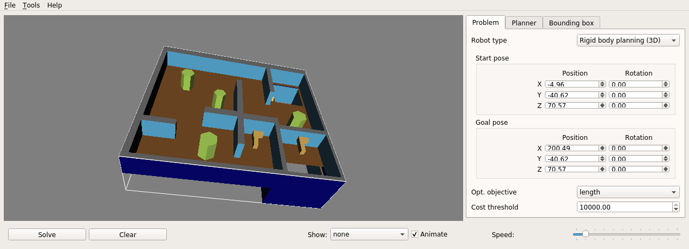

# ompl_demo

## Usage

By default OMPL demo is using `3D/cubicles_env.dae` for the environment and `3D/cubicles_robot.dae` for the robot. You could specify other params via command line.

```bash
python3 /ompl_demo/src/ompl_demo_cartesian.py --help

usage: ompl_demo_cartesian.py [-h] [--start START [START ...]] --goal GOAL
                              [GOAL ...] [--output_file_path OUTPUT_FILE_PATH]
                              [--env_mesh_path ENV_MESH_PATH]
                              [--robot_mesh_path ROBOT_MESH_PATH]

OMPL demo for Cartesian coordinate system

optional arguments:
  -h, --help            show this help message and exit
  --start START [START ...]
                        Start point in a format `x, y, z` in meters
  --goal GOAL [GOAL ...]
                        Goal point in a format `x, y, z` in meters
  --output_file_path OUTPUT_FILE_PATH
                        Path to a .txt file for further visualization
  --env_mesh_path ENV_MESH_PATH
                        Path to environement .dae file
  --robot_mesh_path ROBOT_MESH_PATH
                        Path to robot .dae file
```

```bash
python3 /ompl_demo/src/ompl_demo_geodetic.py  --help

usage: ompl_demo_geodetic.py [-h] [--start START [START ...]] --goal GOAL
                             [GOAL ...] [--output_file_path OUTPUT_FILE_PATH]
                             [--env_mesh_path ENV_MESH_PATH]
                             [--robot_mesh_path ROBOT_MESH_PATH]

OMPL demo for Geodetic coordinate system

optional arguments:
  -h, --help            show this help message and exit
  --start START [START ...]
                        Start point in a format `lat, lon, alt`
  --goal GOAL [GOAL ...]
                        Goal point in a format `lat, lon, alt`
  --output_file_path OUTPUT_FILE_PATH
                        Path to a .txt file for further visualization
  --env_mesh_path ENV_MESH_PATH
                        Path to environement .dae file
  --robot_mesh_path ROBOT_MESH_PATH
                        Path to robot .dae file
```

## Example

- Cartesian coordinate system:
```bash
python3 /ompl_demo/src/ompl_demo_cartesian.py \
    --start -4.96 -40.62 70.57 \
    --goal 200.49 -40.62 70.57
```

- Geodetic coordinate system:
```bash
python3 /ompl_demo/src/ompl_demo_geodetic.py \
    --goal -83.77534490949962 -55.690830378508565 2403.460302218876
```

## Docker

Steps to build and run `docker` image:

- Build an image:
```bash
cd <ompl_demo_repo>/docker/bionic
./build.bash
```

- Run `docker` container ( with X server communication available ):
```bash
cd <ompl_demo_repo>/docker/bionic
./run.bash
```

## Preview result

The result of the `ompl_demo_geodetic.py` or `ompl_demo_cartesian.py` is a text file with path inside of it ( e.g. path to the file is specified by `output_file_path`. It can be viewed by using `OMPL app`. 

Inside the docker container run:

```bash
python3 /ompl_demo/src/ompl_demo_cartesian.py \
    --start -4.96 -40.62 70.57 \
    --goal 200.49 -40.62 70.57
```

It will generate `/ompl_demo/path.txt`, to preview it run:

```bash
ompl_app
```

Then:

- Add environment from `/ompl/omplapp-1.5.2-Source/resources/3D/cubicles_env.dae`;
- Add robot from `/ompl/omplapp-1.5.2-Source/resources/3D/cubicles_robot.dae`;
- Add genereted path `/ompl_demo/path.txt`;
- Result:


